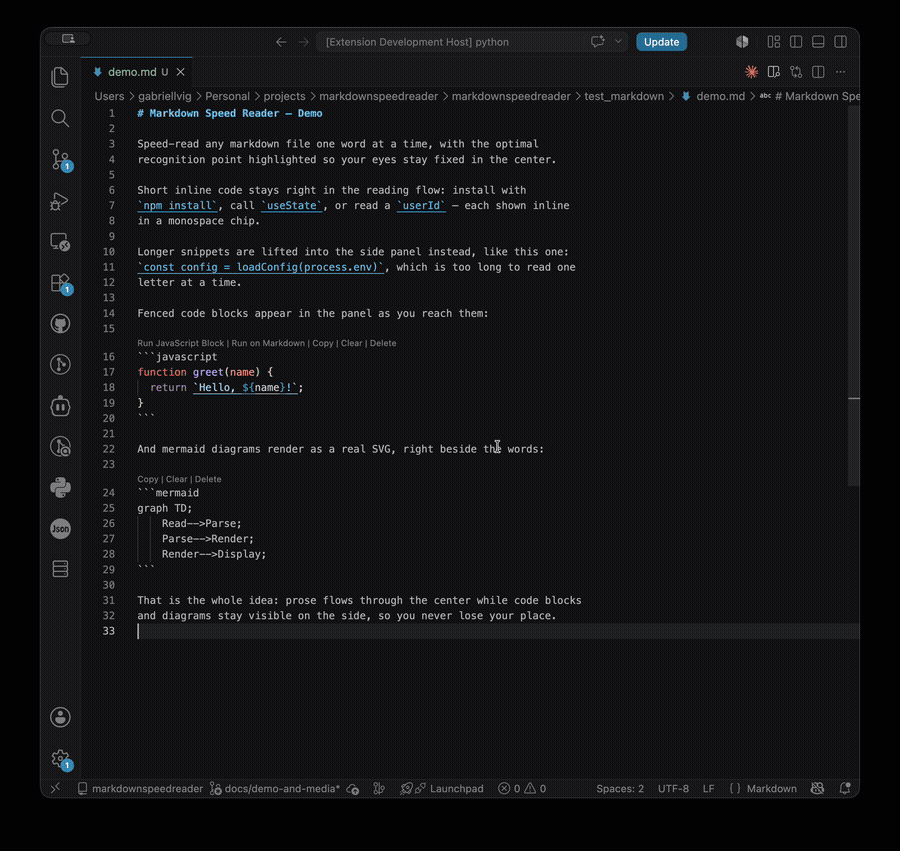

# Markdown Speed Reader - VSCode Extension

A powerful VSCode extension that enables speed reading of markdown and text files with configurable reading speeds, intelligent text processing, and an intuitive user interface.



## Features

- 🚀 **Speed Reading**: Read text at configurable speeds (50-1000 WPM).
- 🎯 **ORP Highlighting**: Optimal Recognition Point (ORP) highlighting for enhanced reading efficiency, applied to both regular words and short inline code.
- 📝 **Advanced Markdown Support**:
    - Intelligent Markdown parsing using `markdown-it`.
    - **Fenced Code Block Handling**: Extracts full code blocks (e.g., ```python ... ```) and displays them in a dedicated, scrollable panel adjacent to the main reading area. This allows you to read descriptive text while simultaneously viewing the associated code.
    - **Inline Code Handling**:
        - Short inline code snippets (e.g., `` `variableName` ``) are specially styled (monospace font, background) and displayed in the main reading area with ORP.
        - Longer inline code snippets are treated as full code blocks and displayed in the dedicated code panel.
- ✨ **Dedicated Code View**: A separate panel within the speed reading UI dynamically displays the content of the current code block, complete with its language identifier if provided in the Markdown.
- 🧜 **Mermaid Diagrams**: ` ```mermaid ` blocks are rendered as live SVG diagrams in the code panel as you reach them. Optionally auto-pause playback on a diagram (`speedreader.autoPauseOnDiagram`) so you can take it in, then resume with Play.
- 🎮 **Intuitive Controls**: Play/pause/stop functionality accessible via UI buttons and keyboard shortcuts (Spacebar for play/pause, Escape for stop).
- 📊 **Progress Tracking**: Visual progress bar indicating your position in the text, with click-to-seek functionality.
- ⚙️ **Configurable Settings**:
    - Customizable reading speed (WPM).
    - Adjustable ORP highlight color via a color picker.
    - Option to enable/disable pausing on punctuation.
- 🎨 **VSCode Integration**: Seamless integration with VSCode themes and context menu options for quick access.
- 📱 **Responsive Design**: The reading interface, including the code panel, adapts well to different panel sizes.

## Installation

1. **From Source**:
   ```bash
   git clone <repository-url>
   cd markdownspeedreader
   npm install
   npm run compile
   ```

2. **Development**: Press `F5` in VSCode to launch a new Extension Development Host window

## Usage

### Commands

The extension provides three main commands accessible via the Command Palette (`Ctrl+Shift+P`):

- **Speed Reader: Speed Read Current File** - Read the currently open file
- **Speed Reader: Speed Read Selection** - Read only the selected text
- **Speed Reader: Speed Read File...** - Open a file picker to select a file to read

### Context Menu Options

- **Right-click in editor**: Access speed reading options for current file or selection
- **Right-click on .md/.txt files in Explorer**: Quick access to speed read specific files

### Keyboard Shortcuts

While the speed reader is active:
- **Space**: Play/Pause reading
- **Escape**: Stop reading and return to beginning

### Speed Reading Interface

The speed reading interface is designed for focused reading and provides comprehensive controls:

1.  **Main Reading Area**:
    *   Displays the current word with the Optimal Recognition Point (ORP) character highlighted.
    *   Short inline code snippets are rendered here with a distinct style (e.g., monospace font, background color) and also feature ORP highlighting.
    *   A "Ready to start reading..." message appears when no text is loaded or after stopping.
2.  **Code Panel**:
    *   Located adjacent to the main reading area.
    *   Dynamically displays the content of the currently active fenced code block or long inline code block.
    *   Includes a header indicating "Code Block" and the detected language (e.g., "Code Block (python)").
    *   Shows a placeholder message like "No code block currently active." when no code block corresponds to the current text position.
3.  **Playback Controls**: Buttons for Play, Pause, and Stop.
4.  **Speed Control**: An input field to adjust WPM (Words Per Minute) from 50 to 1000.
5.  **Progress Bar**:
    *   Visually shows the current reading progress.
    *   Allows seeking to any part of the text by clicking on the bar.
    *   Displays current/total words and percentage.
6.  **Settings**:
    *   A checkbox to toggle "Pause on punctuation."
    *   A color picker to customize the "ORP Highlight Color" in real-time.

### ORP (Optimal Recognition Point) Highlighting

The extension features advanced ORP highlighting to enhance reading speed and comprehension:

- **What is ORP**: The ORP is the character position within a word where your eye should focus for the fastest recognition. This minimizes saccadic eye movements.
- **Algorithm**: The ORP is calculated using the formula `Math.floor(word.length * 0.3)`. For example, in a 10-letter word, the 3rd letter (index 2) would be the ORP. The calculation ensures a valid position even for very short words.
- **Visual Design**:
    - For regular words, the ORP character is displayed in bold and with a customizable color (default: red `#ff4444`). The rest of the word is displayed around this central point.
    - For short inline code snippets displayed in the main reading area, the ORP logic still applies to the code content. The ORP character within the inline code receives a subtle highlight (e.g., slightly different background) to maintain readability within the code's styling.
- **Examples**:
  - "cat" → **c**at (1st character)
  - "quick" → q**u**ick (2nd character)
  - "reading" → re**a**ding (3rd character)
  - "understanding" → und**e**rstanding (4th character)
  - `` `val` `` → `**v**al` (styled as inline code, with 'v' subtly highlighted)
- **Customization**: The ORP highlight color for regular words can be changed in real-time using the color picker in the settings section of the UI.
- **Benefits**: Helps to reduce subvocalization and eye movement, potentially increasing reading speed and improving focus.

## Configuration

Configure the extension via VSCode settings (`File > Preferences > Settings`):

```json
{
  "speedreader.defaultWPM": 250,
  "speedreader.pauseOnPunctuation": true,
  "speedreader.fontSize": 24
}
```

### Available Settings

- **`speedreader.defaultWPM`** (default: 250)
  - Default reading speed in words per minute
  - Range: 50-1000 WPM

- **`speedreader.pauseOnPunctuation`** (default: true)
  - Pause briefly after punctuation marks for better comprehension

- **`speedreader.fontSize`** (default: 24)
  - Font size for the speed reading display
  - Range: 12-48 pixels

## Supported File Types

### Primary Support
- **Markdown** (.md, .markdown)
  - Automatic markdown detection
  - Code block extraction
  - Clean text conversion

### Secondary Support
- **Plain Text** (.txt)
  - Direct text processing
  - Optimal for prose and documentation

### Fallback Support
- **Any text-based file**
  - User confirmation required
  - Basic text processing

## How It Works

### Text Processing Pipeline

The extension processes text through the following stages:

1.  **File Reading/Content Acquisition**: Raw text content is obtained from the active editor, a user selection, or a chosen file (`extension.ts`, `file_reader.ts`).
2.  **Format Detection & Parsing (`markdown_parser.ts` via `ui_module.ts`)**:
    *   The `ui_module.ts` receives the raw text.
    *   It uses `MarkdownParser.isMarkdown()` to check if the content is Markdown.
    *   If it is Markdown, `MarkdownParser.parseMarkdown()`:
        *   Extracts fenced code blocks (e.g., ``` ```) and long inline code snippets. These are stored in an ordered array.
        *   Replaces these extracted code blocks in the main text stream with placeholder tokens (e.g., `[CODE BLOCK N]`).
        *   Wraps short inline code snippets (e.g., `` `code` ``) with special markers (`«code:short»code«/code»`) for distinct rendering.
        *   Converts the remaining Markdown to HTML using `markdown-it`, then strips HTML tags to get clean plain text.
    *   If not Markdown, the raw text is used as is (or after basic whitespace normalization).
3.  **Engine Loading (`speedreading_engine.ts`)**:
    *   The `ui_module.ts` loads the processed plain text (containing placeholders and markers) and the array of extracted code blocks into the `SpeedreadingEngine`.
4.  **Tokenization (`speedreading_engine.ts`)**:
    *   The engine splits the processed plain text into an array of "words" based on whitespace. Placeholders like `[CODE BLOCK N]` become sequences of words (e.g., `"[CODE"`, `"BLOCK"`, `"N]"`) in this array.
5.  **Display & Orchestration (`speedreading_engine.ts` & `ui_module.ts` webview)**:
    *   The engine iterates through the tokenized words.
    *   **For regular words**: It calculates ORP segments and sends them to the webview for display in the main reading area. Words marked as `«code:short»...«/code»` are identified, and this status is passed to the webview for special styling.
    *   **For `[CODE BLOCK N]` tokens**: The engine identifies these sequences, retrieves the corresponding code block from its stored array, and instructs the webview (via a callback) to display this code block in the dedicated code panel.
    *   Words are presented sequentially at the configured WPM, with adaptive timing and punctuation pauses.

### Smart Features

- **Adaptive Timing**: The display duration for each word is slightly adjusted based on its length (longer words get more time) to improve comprehension.
- **Punctuation Awareness**: An optional feature to automatically pause briefly after encountering sentence-ending punctuation (., !, ?, ;).
- **Integrated Code Block Display**: Fenced code blocks and long inline code are shown in a separate, scrollable panel within the UI, synchronized with the text being read. This allows users to view code in context without interrupting the reading flow of the main prose.
- **Styled Inline Code**: Short inline code snippets are visually distinguished within the main reading flow using monospace fonts and background highlights, with ORP applied.
- **Real-time Progress Tracking**: The UI provides a dynamic progress bar and text indicating the current position, total words, and percentage completed. Users can click the progress bar to seek.
- **Memory Efficient**: Designed to handle large documents by processing text into manageable word arrays and efficiently updating the UI.

## Development

### Project Structure

```
src/
├── extension.ts          # Main extension entry point
├── file_reader.ts        # File I/O operations
├── markdown_parser.ts    # Text processing and markdown parsing
├── speedreading_engine.ts # Core reading logic and timing
├── ui_module.ts          # UI management and webview
└── test/                 # Test files
```

### Key Classes

- **`SpeedreadingEngine`**: Core logic for text processing and timing
- **`SpeedreadingUI`**: Webview management and user interface
- **`MarkdownParser`**: Markdown to text conversion with code block handling
- **`FileReader`**: File system operations with error handling

### Building

```bash
# Install dependencies
npm install

# Compile TypeScript
npm run compile

# Watch for changes during development
npm run watch

# Run tests
npm test

# Lint code
npm run lint
```

### Testing

The extension includes comprehensive testing:

```bash
# Run all tests
npm test

# Run with coverage
npm run test:coverage
```

## Architecture

The extension follows a modular architecture with clear separation of concerns:

- **Extension Host**: VSCode integration and command registration
- **Extension Host (`extension.ts`)**: Integrates with VSCode, registers commands, and initiates the speed reading process by passing raw text to the `SpeedreadingUI`.
- **UI Module (`ui_module.ts`)**: Manages the WebviewPanel. It orchestrates the parsing of raw text by invoking the `MarkdownParser`, then initializes and communicates with the `SpeedreadingEngine`. It renders the UI in the webview and handles two-way communication (user inputs to engine, engine updates to webview).
- **Markdown Parser (`markdown_parser.ts`)**: Responsible for detecting Markdown, converting it to plain text, extracting all code blocks (fenced and long inline), replacing them with placeholder tokens, and marking short inline code for special rendering.
- **Speedreading Engine (`speedreading_engine.ts`)**: Contains the core logic for text tokenization, WPM timing, playback control, ORP calculation, and managing the sequence of words and code blocks. It uses callbacks to send updates (current word, active code block, state changes) to the `UI Module`.
- **File Reader (`file_reader.ts`)**: Provides utility for reading file content from the disk, used by the "Speed Read File..." command.
- **Webview UI (HTML/CSS/JS within `ui_module.ts`)**: The client-side interface that displays words, code blocks, controls, and settings. It communicates with the `UI Module` (extension host side) via `postMessage`.

## Contributing

1. Fork the repository
2. Create a feature branch
3. Make your changes
4. Add tests for new functionality
5. Ensure all tests pass
6. Submit a pull request

### Code Style

- Use TypeScript with strict mode
- Follow VSCode extension guidelines
- Include TSDoc comments for public APIs
- Maintain test coverage above 80%

## Troubleshooting

### Common Issues

**Extension not activating:**
- Ensure VSCode version is 1.100.0 or higher
- Check that the extension is enabled in the Extensions panel

**Speed reading not starting:**
- Verify file contains readable text
- Check that the file type is supported
- Try selecting text manually and using "Speed Read Selection"

**Performance issues:**
- Reduce WPM setting for very large files
- Close other resource-intensive extensions
- Restart VSCode if memory usage is high

**UI not displaying correctly:**
- Ensure webview is enabled in VSCode settings
- Try closing and reopening the speed reader panel
- Check browser console for JavaScript errors

### Getting Help

- Check the [Issues](../../issues) page for known problems
- Create a new issue with detailed reproduction steps
- Include VSCode version, extension version, and file type being read

## License

This project is licensed under the MIT License. See [LICENSE](LICENSE) file for details.

## Changelog

### Version 0.0.1
- Initial release
- Basic speed reading functionality
- Markdown and text file support
- Configurable reading speeds
- VSCode theme integration
- Keyboard shortcuts and context menus

## Roadmap

### Upcoming Features
- Reading statistics and analytics
- Custom themes and color schemes
- Code syntax highlighting for programming files
- Reading bookmarks and session saving
- Multi-language support
- Cloud synchronization

### Long-term Goals
- Advanced reading algorithms (variable speed, focus modes)
- Integration with productivity tools
- Collaborative reading features
- Machine learning-based reading optimization

---

**Happy Speed Reading!** 📚⚡
