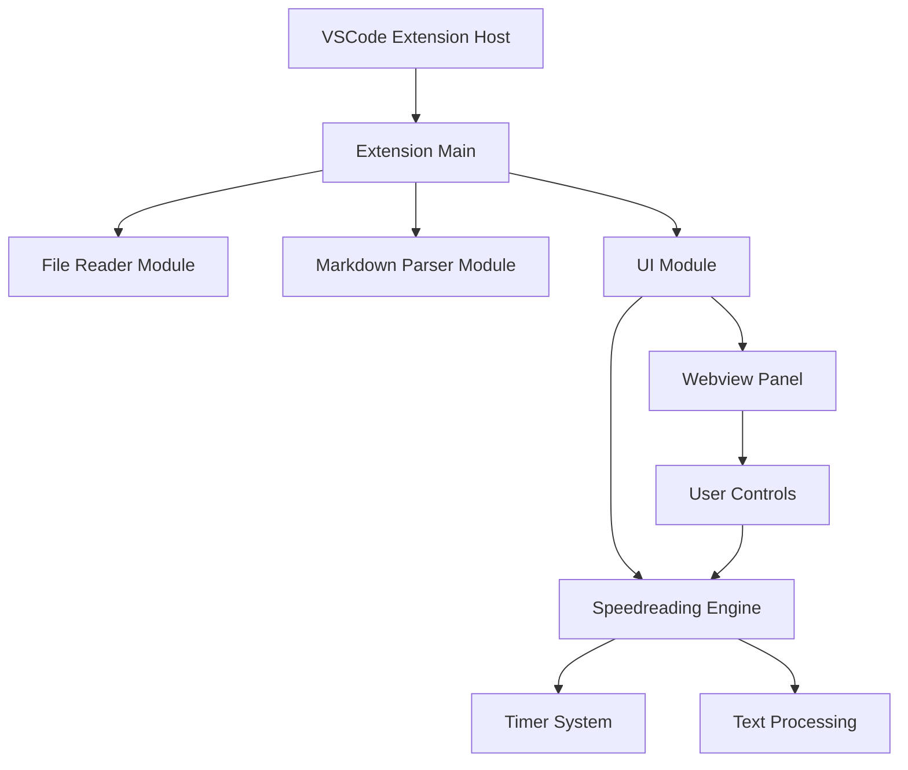
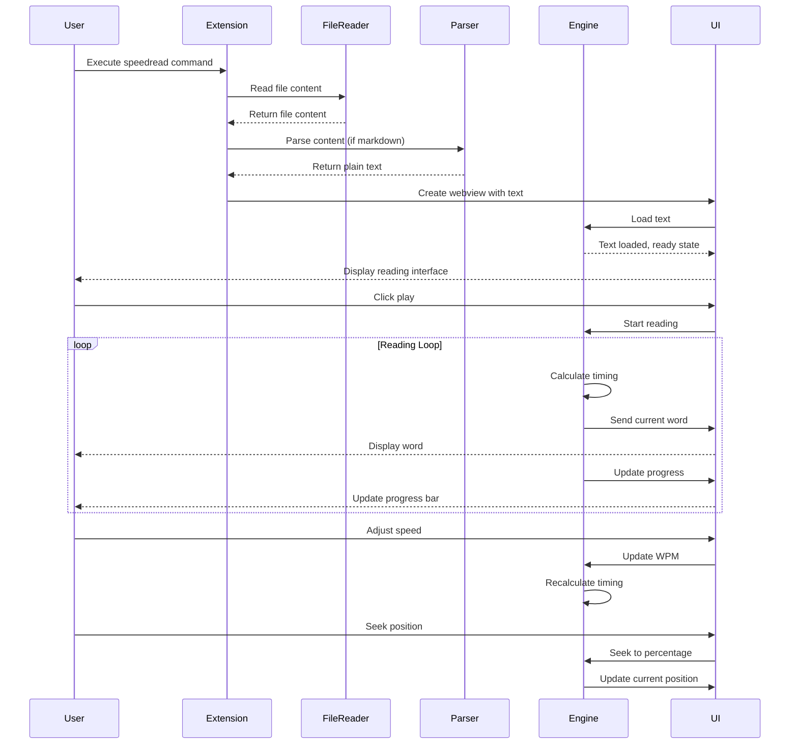

# System Design Document: VSCode Speedreading Extension

## 1. Overall Architecture

The VSCode Speedreading Extension is built using a modular architecture with clean separation of concerns:



**Core Components:**
- **Extension Main (`extension.ts`)**: Entry point and command registration
- **File Reader Module (`file_reader.ts`)**: File I/O operations
- **Markdown Parser Module (`markdown_parser.ts`)**: Text processing and markdown conversion
- **Speedreading Engine (`speedreading_engine.ts`)**: Core reading logic and timing
- **UI Module (`ui_module.ts`)**: Webview management and user interface

## 2. Module Breakdown

### 2.1. File Reader Module (`src/file_reader.ts`)

**Responsibilities:**
- Reading file content from filesystem
- Error handling for file operations
- UTF-8 encoding support

**Implementation:**
```typescript
export class FileReader {
    public static readFile(filePath: string): string | null
}
```

**Inputs:** File path (string)
**Outputs:** File content (string) or null on error

### 2.2. Markdown Parser Module (`src/markdown_parser.ts`)

**Responsibilities:**
- Converting Markdown to plain text
- Extracting and handling code blocks
- Detecting markdown content automatically
- HTML tag removal and text normalization

**Implementation:**
```typescript
export class MarkdownParser {
    public static parseMarkdown(markdownText: string): { parsedText: string; codeBlocks: string[] }
    public static isMarkdown(content: string): boolean
}
```

**Features:**
- Uses `markdown-it` library for robust markdown parsing
- Intelligent code block detection and extraction
- Automatic markdown detection using pattern matching
- Text normalization (whitespace cleanup)

**Inputs:** Raw text content (string)
**Outputs:** 
- Parsed plain text (string)
- Array of extracted code blocks (string[])

### 2.3. Speedreading Engine Module (`src/speedreading_engine.ts`)

**Responsibilities:**
- Text tokenization and word management
- Reading speed control (WPM)
- Playback state management (play/pause/stop)
- Progress tracking and seeking
- Adaptive timing based on word length
- Punctuation-based pausing
- ORP (Optimal Recognition Point) highlighting calculation and rendering

**Implementation:**
```typescript
export class SpeedreadingEngine {
    public loadText(text: string): void
    public play(): void
    public pause(): void
    public stop(): void
    public setWPM(wpm: number): void
    public seekTo(percentage: number): void
    public getState(): SpeedreadingState
    public updateConfig(config: Partial<SpeedreadingConfig>): void
}
```

**Key Features:**
- Configurable reading speed (50-1000 WPM)
- Smart timing adjustments for word length
- Callback system for UI updates
- Punctuation-aware pausing
- Progress tracking and seeking
- ORP highlighting with customizable colors
- Real-time highlighting updates

**Inputs:** 
- Text content (string)
- Configuration (SpeedreadingConfig)
- User controls (play/pause/stop/seek)

**Outputs:**
- Current word display
- Reading state updates
- Progress information

### 2.4. UI Module (`src/ui_module.ts`)

**Responsibilities:**
- VSCode webview panel creation and management
- User interface rendering
- Event handling and user interaction
- Real-time state synchronization
- Responsive design

**Implementation:**
```typescript
export class SpeedreadingUI {
    public show(text: string, context: vscode.ExtensionContext): void
    public dispose(): void
}
```

**UI Features:**
- Clean, focused reading interface
- Playback controls (play/pause/stop)
- Speed adjustment (WPM input)
- Progress bar with seeking
- ORP highlight color picker control
- Keyboard shortcuts (Space = play/pause, Esc = stop)
- VSCode theme integration
- Responsive design for different screen sizes

**Inputs:** 
- Text content for reading
- User interactions (clicks, keyboard)
- State updates from engine

**Outputs:**
- Rendered webview content
- User commands to engine
- Visual feedback

## 3. Data Flow



## 4. Extension Integration

### Commands
- `markdownspeedreader.speedreadFile`: Speed read current file
- `markdownspeedreader.speedreadSelection`: Speed read selected text
- `markdownspeedreader.speedreadFromFile`: Speed read from file picker

### Context Menus
- Editor context menu: Speed read file/selection options
- Explorer context menu: Speed read for .md/.txt files

### Configuration
- `speedreader.defaultWPM`: Default reading speed (250 WPM)
- `speedreader.pauseOnPunctuation`: Pause on punctuation (true)
- `speedreader.fontSize`: Display font size (24px)

## 5. Technical Implementation Details

### File Type Support
- **Primary**: Markdown (.md, .markdown)
- **Secondary**: Plain text (.txt)
- **Fallback**: Any text-based file with user confirmation

### ORP (Optimal Recognition Point) Highlighting
- **Algorithm**: Uses the formula `Math.floor(word.length * 0.3)` to calculate the optimal character position
- **Implementation**: Dynamic HTML generation with `<span>` tags for highlighting
- **Styling**: Bold font-weight with customizable color (default: #ff4444)
- **Real-time Updates**: Color changes apply immediately to the current displayed word
- **Edge Cases**: Handles short words (≤2 characters) by highlighting the first character
- **Performance**: Efficient character-level string manipulation with minimal overhead

### Performance Considerations
- Efficient text tokenization using regex split
- Minimal DOM updates in webview
- Proper disposal of timers and event listeners
- Memory-efficient word array storage
- Optimized ORP highlighting calculation and HTML generation

### Error Handling
- File read errors with user feedback
- Empty content validation
- Graceful fallback for unsupported file types
- Timer cleanup on disposal

### Browser Compatibility
- Modern webview standards
- CSS variables for VSCode theme integration
- Progressive enhancement for features

## 6. Future Extensibility

### Planned Enhancements
- **Code Reading Support**: Syntax-aware reading for programming languages
- **Reading Statistics**: Track reading speed, time spent, words read
- **Custom Themes**: User-defined color schemes and fonts
- **Export Features**: Save reading sessions, bookmarks
- **Advanced Controls**: Variable speed reading, focus modes
- **Multi-language Support**: Internationalization

### Architecture Considerations
- Plugin system for custom text processors
- Configurable reading algorithms
- External API integration possibilities
- Cloud synchronization support

## 7. Code Structure and Guidelines

### File Organization
```
src/
├── extension.ts          # Main extension entry point
├── file_reader.ts        # File I/O operations
├── markdown_parser.ts    # Text processing
├── speedreading_engine.ts # Core reading logic
├── ui_module.ts          # UI management
└── test/                 # Test files
```

### Naming Conventions
- **Classes**: PascalCase (e.g., `SpeedreadingEngine`)
- **Methods**: camelCase (e.g., `loadText`)
- **Constants**: UPPER_SNAKE_CASE (e.g., `DEFAULT_WPM`)
- **Interfaces**: PascalCase with descriptive names

### Documentation Standards
- TSDoc comments for all public methods
- Inline comments for complex logic
- README with usage examples
- Type definitions for all interfaces

### Testing Strategy
- Unit tests for core engine logic
- Integration tests for file operations
- Mock tests for VSCode API interactions
- Manual testing for UI responsiveness
