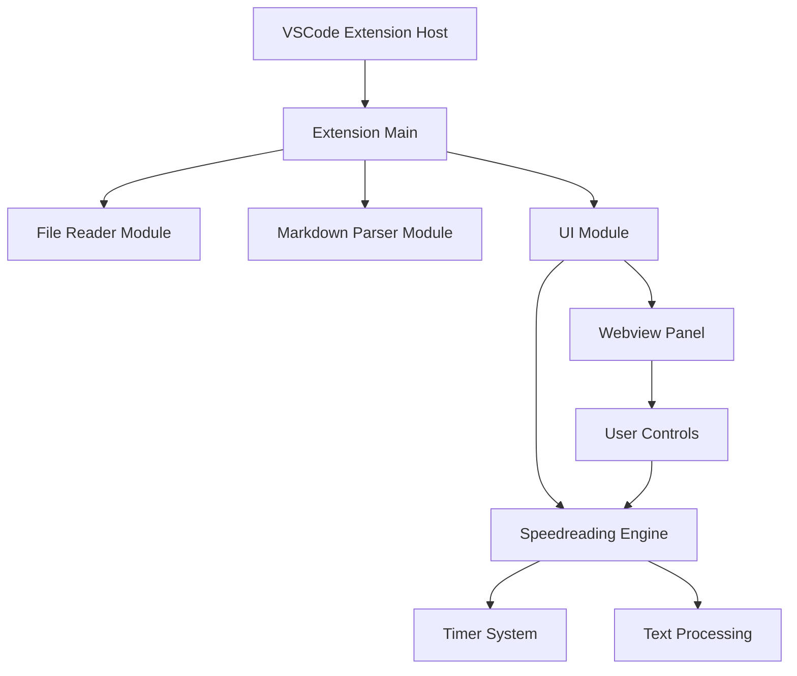
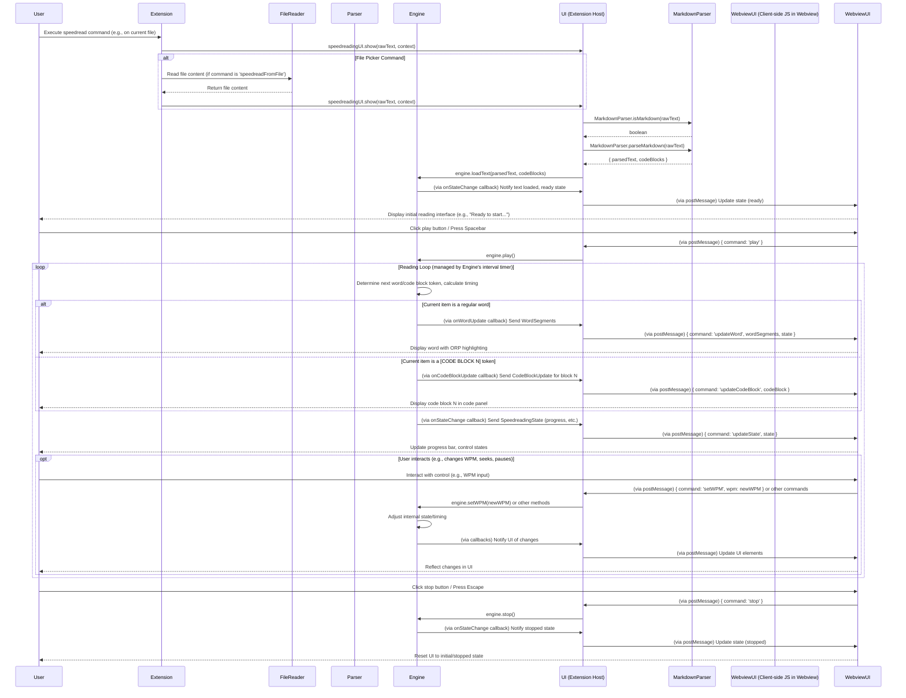

# System Design Document: VSCode Speedreading Extension

## 1. Overall Architecture

The VSCode Speedreading Extension is built using a modular architecture with clean separation of concerns:



**Core Components:**
- **Extension Main (`extension.ts`)**: Entry point, command registration, and initial acquisition of text content from the VSCode editor or file system. It passes raw text to the UI Module.
- **File Reader Module (`file_reader.ts`)**: Handles file system read operations, invoked by Extension Main for the "Speed Read File..." command.
- **Markdown Parser Module (`markdown_parser.ts`)**: Responsible for converting Markdown to plain text, extracting fenced code blocks and long inline code snippets (replacing them with placeholder tokens like `[CODE BLOCK N]`), and marking short inline code snippets (e.g., `«code:short»...«/code»`) for special rendering.
- **UI Module (`ui_module.ts`)**: Manages the VSCode WebviewPanel. It receives raw text, invokes the Markdown Parser, and then initializes the Speedreading Engine with the parsed text and extracted code blocks. It handles all user interactions within the webview and communicates updates between the webview and the engine.
- **Speedreading Engine (`speedreading_engine.ts`)**: Contains the core speedreading logic, including text tokenization (from parsed text), word timing, WPM control, playback state (play/pause/stop/seek), ORP calculation, and managing the display sequence of words and code blocks. It communicates with the UI module via callbacks to update the displayed word, code block, and reading state.

## 2. Module Breakdown

### 2.1. File Reader Module (`src/file_reader.ts`)

**Responsibilities:**
- Reading file content from filesystem
- Error handling for file operations
- UTF-8 encoding support

**Implementation:**
```typescript
export class FileReader {
    public static readFile(filePath: string): string | null
}
```

**Inputs:** File path (string)
**Outputs:** File content (string) or null on error

### 2.2. Markdown Parser Module (`src/markdown_parser.ts`)

**Responsibilities:**
- Converting Markdown to plain text.
- Extracting fenced code blocks (e.g., ``` ```) and long inline code snippets (e.g., `` `some_long_code()` ``).
- Replacing extracted code blocks in the main text stream with indexed placeholder tokens (e.g., `[CODE BLOCK N]`).
- Marking short inline code snippets (e.g., `` `short` ``) with special tags (e.g., `«code:short»short«/code»`) for distinct rendering by the UI.
- Detecting whether content is likely Markdown using heuristic patterns.
- Removing HTML tags (after markdown-to-HTML conversion) and normalizing whitespace to produce clean text for the speedreading engine.

**Implementation:**
```typescript
export class MarkdownParser {
    public static parseMarkdown(markdownText: string): { parsedText: string; codeBlocks: string[] }
    public static isMarkdown(content: string): boolean
}
```

**Features:**
- Utilizes the `markdown-it` library for robust Markdown parsing.
- Implements intelligent detection and extraction for both fenced code blocks and long inline code (treating the latter as full code blocks).
- Preserves short inline code by wrapping it with special markers, allowing the UI to apply specific styling.
- Employs pattern matching for automatic Markdown content detection.
- Normalizes whitespace and cleans HTML artifacts to prepare text for the speedreading engine.

**Inputs:** Raw text content (string).
**Outputs:** An object containing:
- `parsedText`: A string of plain text where code blocks have been replaced by placeholder tokens (e.g., `[CODE BLOCK N]`) and short inline code is marked (e.g., `«code:short»...«/code»`).
- `codeBlocks`: An array of strings, where each string is an extracted code block (including long inline code snippets). The order corresponds to the placeholder token indices.

### 2.3. Speedreading Engine Module (`src/speedreading_engine.ts`)

**Responsibilities:**
- Tokenizing the `parsedText` (received from the UI module, after Markdown parsing) into individual words.
- Managing the stream of words and the collection of `codeBlocks`.
- Controlling reading speed (Words Per Minute - WPM).
- Managing playback state (play, pause, stop).
- Tracking reading progress and allowing seeking to specific text positions.
- Implementing adaptive timing, adjusting display duration based on word length.
- Handling punctuation-based pausing for improved comprehension.
- Calculating Optimal Recognition Point (ORP) for each word and segmenting words for highlighting.
- Identifying `[CODE BLOCK N]` tokens in the word stream and triggering the display of the corresponding code block in the UI via a callback.
- Recognizing `«code:short»...«/code»` markers for short inline code and providing this information to the UI for special rendering.

**Implementation:**
```typescript
export interface SpeedreadingConfig { /* ... */ }
export interface WordSegments { /* ... */ }
export interface CodeBlockUpdate { /* ... */ }
export interface SpeedreadingState { /* ... */ }

export class SpeedreadingEngine {
    public constructor(config: SpeedreadingConfig)
    public loadText(text: string, codeBlocks: string[] = []): void
    public play(): void
    public pause(): void
    public stop(): void
    public setWPM(wpm: number): void
    public seekTo(percentage: number): void
    public getState(): SpeedreadingState
    public getConfig(): SpeedreadingConfig
    public updateConfig(config: Partial<SpeedreadingConfig>): void
    public setOnWordUpdate(callback: (wordSegments: WordSegments, state: SpeedreadingState) => void): void
    public setOnStateChange(callback: (state: SpeedreadingState) => void): void
    public setOnCodeBlockUpdate(callback: (update: CodeBlockUpdate) => void): void
    // Private methods for internal logic...
}
```

**Key Features:**
- Configurable reading speed (50-1000 WPM) with clamping.
- Smart timing adjustments: longer words displayed for a slightly longer duration.
- Robust callback system for UI updates:
    - `onWordUpdate`: Sends `WordSegments` (including ORP details and inline code status) for the current word.
    - `onStateChange`: Notifies UI of changes in playback state or progress.
    - `onCodeBlockUpdate`: Instructs UI to display a specific code block when a `[CODE BLOCK N]` token is encountered.
- Punctuation-aware pausing: Optional brief pause after sentence-ending punctuation.
- Accurate progress tracking and seeking capabilities, including recalculating active code block on seek.
- ORP highlighting calculation (`Math.floor(word.length * 0.3)`) with customizable ORP character color.
- Real-time application of configuration changes (e.g., WPM, ORP color).
- Handles `[CODE BLOCK N]` tokens to orchestrate the display of full code blocks.
- Identifies `«code:short»...«/code»` markers to enable special UI rendering for short inline code.

**Inputs:** 
- `parsedText`: Plain text string (with code block placeholders and short inline code markers) from the UI Module (originating from Markdown Parser).
- `codeBlocks`: Array of extracted code block strings from the UI Module (originating from Markdown Parser).
- `SpeedreadingConfig`: Configuration object for WPM, colors, pausing behavior.
- User control commands (play, pause, stop, seek, WPM change, config update) relayed from the UI Module.

**Outputs (via Callbacks to UI Module):**
- `WordSegments`: Detailed information for displaying the current word, including `before`, `orp`, `after` parts, and `isInlineCode` status.
- `SpeedreadingState`: Updates on the current playback state (isPlaying, currentIndex, totalWords, progress).
- `CodeBlockUpdate`: Instructions for the UI on which code block to display (content, language, active status).
- Progress information as part of `SpeedreadingState`.

### 2.4. UI Module (`src/ui_module.ts`)

**Responsibilities:**
- Creating and managing the VSCode WebviewPanel that hosts the speedreading interface.
- Rendering the complete user interface within the webview using HTML, CSS, and JavaScript.
- Handling user interactions from the webview (e.g., button clicks, input changes, keyboard shortcuts) and relaying corresponding commands to the `SpeedreadingEngine`.
- **Orchestrating text processing**: Upon receiving raw text from `extension.ts`, it invokes `MarkdownParser.isMarkdown` and `MarkdownParser.parseMarkdown` to get processed text and code blocks.
- Initializing and communicating with the `SpeedreadingEngine`: Loads parsed text and code blocks into the engine, and subscribes to engine callbacks (`onWordUpdate`, `onStateChange`, `onCodeBlockUpdate`).
- Updating the webview display in real-time based on data received from the `SpeedreadingEngine`'s callbacks (e.g., displaying the current word with ORP, showing active code blocks, updating progress bar and control states).
- Managing the display of the main reading word with ORP highlighting and a separate panel for full code blocks.
- Applying special styling for short inline code snippets within the main word display area.
- Ensuring responsive UI design.

**Implementation:**
```typescript
export class SpeedreadingUI {
    public constructor()
    public show(text: string, context: vscode.ExtensionContext): void
    public dispose(): void
    // Private methods for webview setup, message handling, HTML generation
}
```

**UI Features:**
- A clean, focused reading interface with a large area for the current word and ORP highlight.
- **A dedicated, adjacent panel (`code-panel`) within the webview to display the content of active code blocks, including language identifier if available.**
- **Special visual styling for short inline code snippets (e.g., monospace font, background color) when they appear as the current "word" in the main reading area.**
- Standard playback controls: Play, Pause, Stop buttons.
- Adjustable reading speed via a WPM (Words Per Minute) input field.
- A visual progress bar that also allows seeking by clicking.
- UI controls for settings:
    - Checkbox to toggle pausing on punctuation.
    - Color picker to customize the ORP highlight color.
- Keyboard shortcuts within the webview: Spacebar for Play/Pause, Escape key for Stop.
- Seamless integration with VSCode themes using CSS variables.
- Responsive design adapting to different panel sizes.

**Inputs:** 
- Raw text content (string) from `extension.ts`.
- `vscode.ExtensionContext` for resource management (e.g., local URIs for webview).
- User interactions originating from the webview (clicks on buttons, changes to inputs, keyboard events), received via `postMessage`.
- Updates from `SpeedreadingEngine` (current word segments, state changes, code block data) received via registered callbacks.

**Outputs:**
- A fully rendered HTML/CSS/JS webview interface presented to the user.
- Commands relayed to the `SpeedreadingEngine` (e.g., play, pause, setWPM, seekTo, updateConfig) based on webview interactions.
- Visual feedback and real-time updates within the webview (e.g., changing word, moving progress bar, active code block display).

## 3. Data Flow



## 4. Extension Integration

### Commands
- `markdownspeedreader.speedreadFile`: Speed read current file
- `markdownspeedreader.speedreadSelection`: Speed read selected text
- `markdownspeedreader.speedreadFromFile`: Speed read from file picker

### Context Menus
- Editor context menu: Speed read file/selection options
- Explorer context menu: Speed read for .md/.txt files

### Configuration
VSCode settings allow users to customize the extension's behavior. These are typically defined in `package.json` and accessed via `vscode.workspace.getConfiguration('speedreader')`. The `SpeedreadingUI` module initializes the `SpeedreadingEngine` with default values, which can be overridden by user settings.
- `speedreader.defaultWPM`: Default reading speed in Words Per Minute. (Default: 250 WPM, as set in `SpeedreadingUI`'s initial config for the engine).
- `speedreader.pauseOnPunctuation`: Boolean to enable/disable pausing on punctuation marks. (Default: true).
- `speedreader.fontSize`: Font size for the reading display in the webview. (Default: 24px. This is primarily a UI-side setting managed by the webview's CSS and JS, influenced by the initial config).
- `speedreader.orpHighlightColor`: Default color for the ORP character highlight. (Default: `#ff4444`, as set in `SpeedreadingUI`'s initial config).

## 5. Technical Implementation Details

### File Type Support
- **Primary**: Markdown (.md, .markdown)
- **Secondary**: Plain text (.txt)
- **Fallback**: Any text-based file with user confirmation

### ORP (Optimal Recognition Point) Highlighting
- **Algorithm**: The ORP is calculated using the formula `Math.floor(word.length * 0.3)` by the `SpeedreadingEngine`. A safe position is ensured by `Math.max(0, Math.min(orpPosition, word.length - 1))`.
- **Implementation**: The `SpeedreadingEngine` calculates `WordSegments` (`before`, `orp`, `after`). The `SpeedreadingUI`'s webview JavaScript dynamically renders these segments into three `<span>` elements (`word-before`, `word-orp`, `word-after`) and positions them carefully using character width measurements for precise centering of the ORP character.
- **Styling**: The `word-orp` span is styled with a bold font-weight and a customizable color (default: `#ff4444`, configurable via UI and potentially VSCode settings). For short inline code, the ORP highlight is more subtle (e.g., slight background change) to blend with code styling.
- **Real-time Updates**: ORP highlight color changes made via the UI color picker are applied immediately to the currently displayed word and subsequent words.
- **Edge Cases**: The `safePosition` calculation handles very short words (e.g., 1-2 characters) by highlighting the first character.
- **Performance**: ORP calculation is done per word. Webview DOM updates are targeted to the word display elements. Character width measurement in the webview is cached or done efficiently.

### Code Block Handling
- **Extraction & Tokenization**: The `MarkdownParser` module identifies fenced code blocks (e.g., ``` ```) and long inline code. These are extracted into a `codeBlocks` array, and their original positions in the text are replaced with placeholder tokens like `[CODE BLOCK N]`.
- **Storage & Management**: The `SpeedreadingEngine` receives and stores the `parsedText` (with tokens) and the `codeBlocks` array from the `UIModule`.
- **Activation & Display**: When the `SpeedreadingEngine` encounters a `[CODE BLOCK N]` token (which is split into `[CODE`, `BLOCK`, `N]` words during tokenization) in its word stream, it uses the `onCodeBlockUpdate` callback to send the content and language (if detected from ```lang) of the Nth code block to the `UIModule`. The `UIModule`'s webview then displays this code block in a dedicated `code-panel`.
- **Seeking**: If the user seeks to a different part of the text, the `SpeedreadingEngine` recalculates which code block (if any) should be currently active based on the tokens encountered up to the seek position and updates the UI accordingly.
- **UI Presentation**: The webview features a `code-panel` adjacent to the main word display area. When a code block is active, its content is shown here. Otherwise, a placeholder message (e.g., "No code block currently active.") is displayed.

### Short Inline Code Handling
- **Marking**: The `MarkdownParser` identifies short inline code snippets (e.g., `` `variable` ``, up to 20 characters) and wraps them with special markers: `«code:short»content«/code»`. These markers are part of the `parsedText` fed to the `SpeedreadingEngine`.
- **Engine Processing**: The `SpeedreadingEngine`'s `calculateWordSegments` method detects these markers in a word. If found, it sets `isInlineCode: true` and extracts the `inlineCodeContent` in the `WordSegments` object sent to the UI.
- **UI Rendering**: The `SpeedreadingUI`'s webview JavaScript (`updateWordDisplay` function) checks the `isInlineCode` flag. If true, it applies distinct styling to the main `wordContainer` (e.g., monospace font, background color similar to VSCode's inline code style). The ORP calculation is still applied to the `inlineCodeContent`, but the visual ORP highlight might be styled differently (e.g., more subtle) to complement the code aesthetic.

### Performance Considerations
- Efficient text tokenization in `SpeedreadingEngine` (splits by whitespace).
- `MarkdownParser` uses regex for code block extraction and `markdown-it` for parsing, which are generally performant.
- Minimal and targeted DOM updates in the webview for word display and code block changes.
- Proper disposal of timers and event listeners by `SpeedreadingEngine` and `SpeedreadingUI` to prevent leaks.
- Memory-efficient storage of words and code blocks.
- Optimized ORP highlighting calculation and HTML generation/positioning in the webview.

### Error Handling
- `FileReader` handles file read errors and shows VSCode error messages.
- `extension.ts` checks for empty content in files or selections and provides user feedback.
- Graceful fallback for unsupported file types (user confirmation prompt).
- `SpeedreadingEngine` and `SpeedreadingUI` manage their states to prevent errors during operations like play/pause/stop on empty content.
- Timer cleanup on disposal of the engine or UI panel.

### Browser Compatibility (Webview Environment)
- Relies on modern web standards supported by VSCode's webview (Chromium-based).
- Uses CSS variables (e.g., `var(--vscode-editor-background)`) for seamless VSCode theme integration.
- JavaScript in the webview uses standard DOM APIs.
- Progressive enhancement principles applied where appropriate.

## 6. Future Extensibility

### Planned Enhancements
- **Code Reading Support**: Syntax-aware reading for programming languages
- **Reading Statistics**: Track reading speed, time spent, words read
- **Custom Themes**: User-defined color schemes and fonts
- **Export Features**: Save reading sessions, bookmarks
- **Advanced Controls**: Variable speed reading, focus modes
- **Multi-language Support**: Internationalization

### Architecture Considerations
- Plugin system for custom text processors
- Configurable reading algorithms
- External API integration possibilities
- Cloud synchronization support

## 7. Code Structure and Guidelines

### File Organization
```
src/
├── extension.ts          # Main extension entry point
├── file_reader.ts        # File I/O operations
├── markdown_parser.ts    # Text processing
├── speedreading_engine.ts # Core reading logic
├── ui_module.ts          # UI management
└── test/                 # Test files
```

### Naming Conventions
- **Classes**: PascalCase (e.g., `SpeedreadingEngine`)
- **Methods**: camelCase (e.g., `loadText`)
- **Constants**: UPPER_SNAKE_CASE (e.g., `DEFAULT_WPM`)
- **Interfaces**: PascalCase with descriptive names

### Documentation Standards
- TSDoc comments for all public methods
- Inline comments for complex logic
- README with usage examples
- Type definitions for all interfaces

### Testing Strategy
- Unit tests for core engine logic
- Integration tests for file operations
- Mock tests for VSCode API interactions
- Manual testing for UI responsiveness
