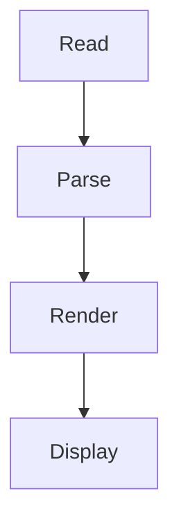

# Markdown Speed Reader — Demo

Speed-read any markdown file one word at a time, with the optimal
recognition point highlighted so your eyes stay fixed in the center.

Short inline code stays right in the reading flow: install with
`npm install`, call `useState`, or read a `userId` — each shown inline
in a monospace chip.

Longer snippets are lifted into the side panel instead, like this one:
`const config = loadConfig(process.env)`, which is too long to read one
letter at a time.

Fenced code blocks appear in the panel as you reach them:

```javascript
function greet(name) {
  return `Hello, ${name}!`;
}
```

And mermaid diagrams render as a real SVG, right beside the words:



That is the whole idea: prose flows through the center while code blocks
and diagrams stay visible on the side, so you never lose your place.
