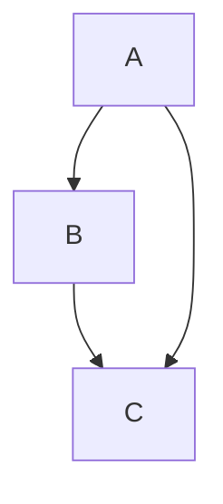

# Mermaid Test

This document contains a mermaid diagram used to exercise the diagram
rendering path of the speed reader.

Here is some intro prose before the diagram so the reader has a few words
to advance through first.

And some closing prose after the diagram so playback continues past the
diagram block.
